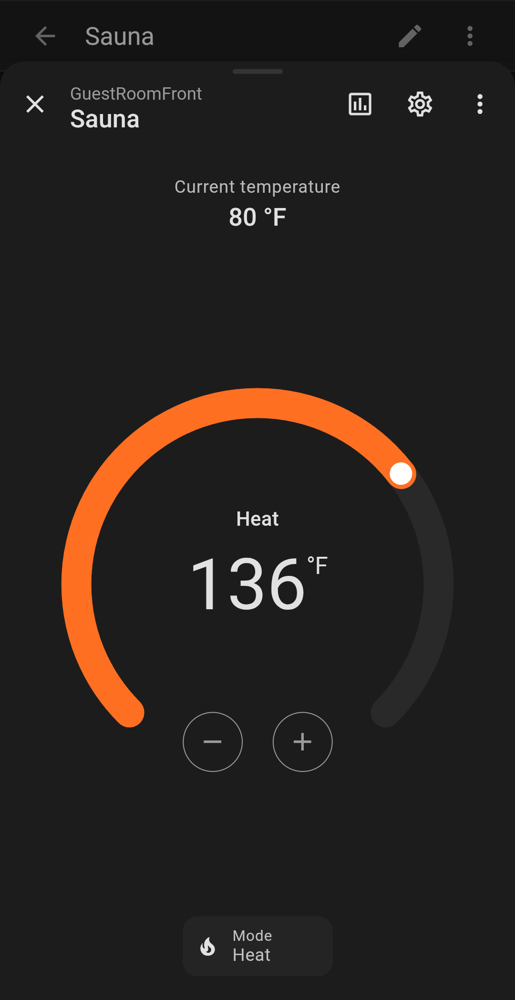
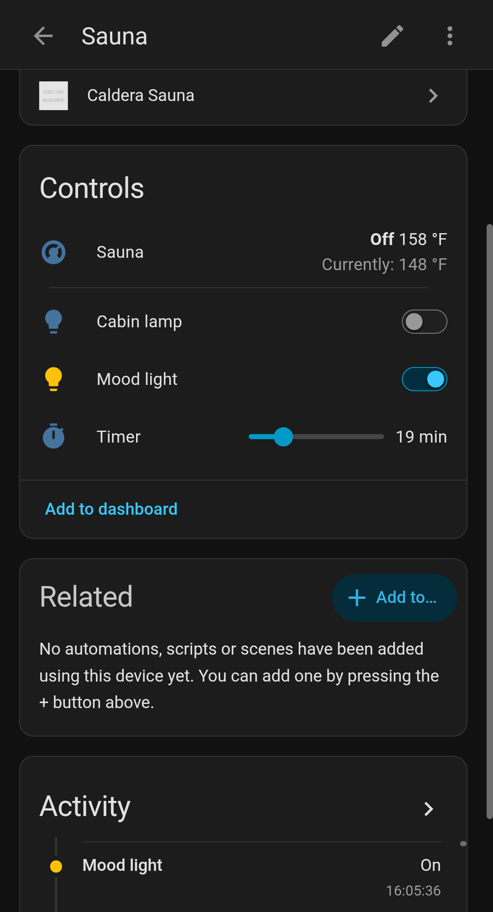

# Caldera Sauna — Home Assistant integration

Local control of **Relaxe Caldera** infrared saunas over Bluetooth LE — no cloud,
no account. Adds sauna controls to Home Assistant, and works through an ESPHome
BLE proxy if the sauna is out of range of your HA host.

<p align="center">
  
  &nbsp;&nbsp;
  
</p>

> ⚠️ **Safety:** Unofficial, **as-is** software with **no warranty** — and **not a
> safety device.** Never rely on it as your only safeguard. Follow all of the
> sauna manufacturer's safety instructions, **including unplugging the sauna when
> it's not in use**, and never run it unattended. See
> [Safety & liability](#safety--liability) below.

## Install (HACS)

1. In **HACS → ⋮ → Custom repositories**, add
   `https://github.com/realark/caldera-ble` as an **Integration**.
2. Search for **Caldera Sauna**, download it, and **restart Home Assistant**.
3. Open **Settings → Devices & Services** — your sauna should be discovered
   automatically. Click **Configure** to add it.

> Disconnect the manufacturer's phone app from the sauna first — the sauna
> allows only one Bluetooth connection at a time.

That's it. You'll get:

- **Climate** — power on/off, current & target temperature
- **Light** — RGB mood light (color presets as effects)
- **Switch** — cabin lamp
- **Number** — session timer (minutes)

### Manual install (without HACS)

Copy `custom_components/caldera_sauna/` into your HA `config/custom_components/`
and restart.

---

## How it works

Reverse-engineered from the manufacturer's Android app: the sauna exposes a
cheap serial-over-BLE module (service `FFF0`, characteristic `FFF1`) speaking a
plain ASCII protocol — no pairing, PIN, or auth. The integration talks to it
through Home Assistant's Bluetooth stack, so both host adapters and ESPHome BLE
proxies work. Full wire protocol: [`PROTOCOL.md`](PROTOCOL.md).

The protocol logic lives in a standalone, hardware-independent Python library
([`caldera-sauna`](https://pypi.org/project/caldera-sauna/) on PyPI); the Home
Assistant integration is a thin layer on top.

## Developing

```
src/caldera_sauna/
  protocol.py   pure codec (no I/O) — encode commands, decode status frames
  device.py     bleak + bleak-retry-connector transport (proxy-compatible)
  monitor.py    read-only CLI: scan, connect, print decoded state
scripts/          hardware probes / calibration tools (read-only unless noted)
tests/            unit tests for the codec (no hardware needed)
custom_components/caldera_sauna/   the Home Assistant integration
```

```bash
python3 -m venv .venv && . .venv/bin/activate
pip install -e ".[dev]"
pytest                       # codec tests, no hardware
ruff check src tests scripts custom_components
```

Device-specific info stays out of git — copy `.env.example` to `.env` and set
your sauna's BLE address (find it with `bluetoothctl scan on` or nRF Connect).
The `scripts/` tools read `.env`; with no address set they scan by name
(default `Sauna`). Read-only state monitor:

```bash
caldera-sauna-monitor        # scan by name, print decoded state; sends nothing
```

Releases are cut with `./release.sh <version>` (bumps versions, publishes to
PyPI, tags, pushes, and creates the GitHub release HACS installs from).

## Safety & liability

This is free, unofficial, **as-is** software (see [LICENSE](LICENSE)). It comes
with **no warranty of any kind**, and the authors accept **no liability** for any
damage, injury, or loss arising from its use — including malfunction, incorrect
readings, dropped or delayed commands, or a heater being left on.

**This is not a safety device.** Do not rely on it for safety-critical control of
your sauna. Your sauna's own built-in thermostat, timer, and over-temperature
protection are the safety layer — this software must never be your only line of
defense. Don't run the sauna unattended, and follow the manufacturer's safety
instructions. By using this software you accept full responsibility for the
outcome.

Independent project — not affiliated with, endorsed by, or supported by Relaxe
or Caldera. Reverse-engineered for personal interoperability.
